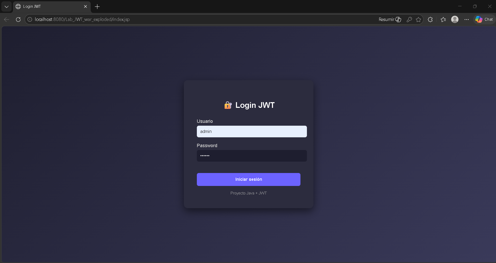
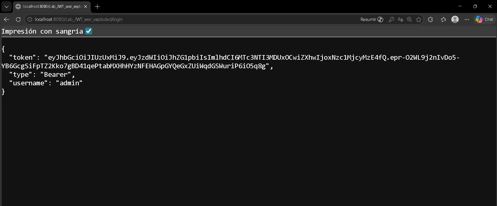

# 🔐 JWT Authentication Demo (Java Servlets)





## 🚀 Overview

This project demonstrates a **stateless authentication system** using **JWT (JSON Web Tokens)** implemented with **Java Servlets (Java Core)** — without frameworks like Spring.

The goal is to understand how authentication works at a low level, including **sessions, cookies, filters, and token-based security**.

---

## ⚙️ Tech Stack

* Java 17
* Java Servlets (javax.servlet-api)
* Maven
* Apache Tomcat
* MySQL (XAMPP)
* JWT (jjwt library)

---

## 🔑 Features

* 🔐 Login endpoint that generates JWT
* 🧱 Custom authentication filter (`JwtFilter`)
* 🚪 Protected route (`/home`)
* ❌ Stateless authentication (no sessions)
* 🧪 Manual token testing via UI
* 🔍 Debug logging for token validation

---

## 🧠 How It Works

```text
Login → generate JWT
↓
Client sends token in Authorization header
↓
JwtFilter intercepts request
↓
Token is validated (signature + expiration)
↓
Access granted or denied
```

---

## 📁 Project Structure

```text
src/
├── servlet/
│   ├── LoginServlet.java
│   └── HomeServlet.java
├── filter/
│   └── JwtFilter.java
├── util/
│   ├── DBConnection.java
│   └── JwtUtil.java
├── dao/
│   ├── UserDAO.java
├── model/
│   ├── User.java

webapp/
├── home.jsp / html
├── index.jsp / html
```

---

## 🧪 How to Run

1. Build the project:

```bash
mvn clean package
```

2. Deploy `.war` into Tomcat:

```text
/webapps/
```

3. Start Tomcat

4. Open in browser:

```text
http://localhost:8080/your-project/
```

---

## 🔐 How to Test

1. Login → obtain JWT
2. Copy the token
3. Paste it into the token input view
4. Access protected route `/home`

---

## ⚔️ Security Insights

This project explores real-world security concepts:

* 🔥 Difference between **Sessions vs JWT**
* 💀 Token hijacking risks
* ⚠️ XSS implications when using localStorage
* 🔐 Why HttpOnly cookies matter
* 🧠 Stateless vs stateful authentication

---

## ❗ Important Notes

* JWT secret key must be **≥ 256 bits**
* Tokens expire (configurable)
* No `HttpSession` is used (stateless design)
* JSP sessions are disabled (`session="false"`)

---

## 🧠 What I Learned

* How authentication works internally (beyond frameworks)
* How JWT replaces server-side sessions
* How filters act as middleware in Java
* Security implications of token-based systems

---

## 🚀 Future Improvements

* Refresh tokens
* Role-based authorization (RBAC)
* Secure token storage (HttpOnly cookies)
* Logout mechanism (token invalidation)
* Frontend integration (React/Vue)

---

## 👨‍💻 Author

Developed as part of backend and security learning path.

---

## ⭐ Final Thought

> Authentication is not just about logging in —
> it's about **trust, validation, and control of identity**.
